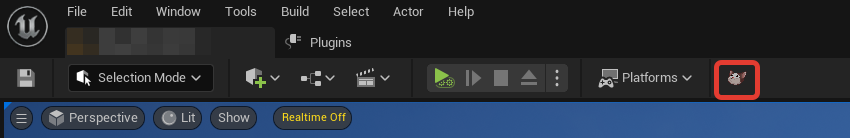
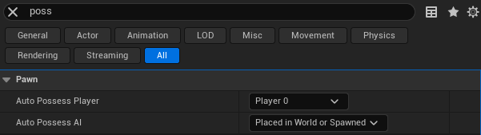

<h1 align="center">Hello everyone, we <a href="https://boosty.to/adscore/" target="_blank">VOORHU</a>, we present to you AutoPossess</h1>

<!--

-->
  
# Information

### This plugin allows you to install a pawn player controller in one click.

### Supported versions Unreal Engine: 5.2, 5.1

### For all questions, you can write here: voorhu@gmail.com

# Documentation

### Select the desired pawn or character and press the button with kitty.

### After pressing, the selected pawn or character will be assigned Player0, in all others it will be Disabled.

